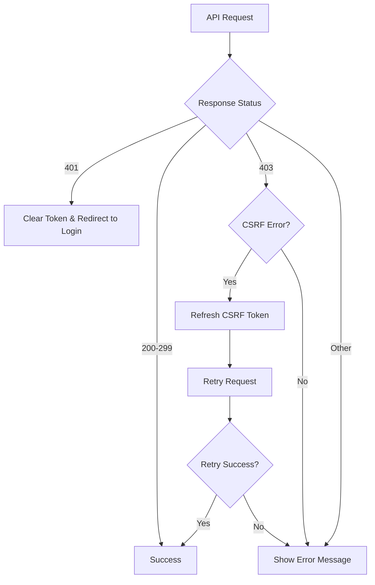

# Design Document

## Overview

現在のシステムでは、バックエンドにCSRF保護が実装されているが、フロントエンドがCSRFトークンを適切に処理していないため、ユーザー登録時に403 Forbiddenエラーが発生している。この設計では、フロントエンドとバックエンド間でCSRFトークンを正しく送受信する仕組みを実装する。

## Architecture

### Current State
- バックエンド: CsrfController実装済みだが、登録時にJWT認証を要求する問題あり
- フロントエンド: CSRFトークン処理なし
- 認証: JWT Bearer Token使用

### Target State
- バックエンド: 未認証ユーザーでもCSRFトークンを取得可能に修正
- フロントエンド: CSRFトークン自動取得・送信機能
- API呼び出し: 自動的にCSRFトークンをヘッダーに含める
- エラーハンドリング: CSRF関連エラーの適切な処理

## Components and Interfaces

### 1. Backend CSRF Controller 修正
**ファイル**: バックエンドの`CsrfController.java`

**変更点**:
- `getCsrfToken`メソッドから JWT認証要求を削除
- セッションIDの代わりに一意識別子（UUID等）を使用
- 未認証ユーザーでもCSRFトークンを取得可能に

### 2. CSRF Service (新規作成)
**ファイル**: `src/app/services/csrfService.ts`

**責任**:
- CSRFトークンの取得
- トークンの保存・管理
- トークンの有効性チェック

**インターフェース**:
```typescript
interface CsrfService {
  getCsrfToken(): Promise<string>;
  refreshCsrfToken(): Promise<string>;
  isTokenValid(): boolean;
}
```

### 3. API Service 拡張
**ファイル**: `src/app/services/api.ts`

**変更点**:
- リクエストインターセプターにCSRFトークン追加機能
- 403エラー時の自動リトライ機能
- CSRFトークン取得の統合

### 4. Auth Service 拡張
**ファイル**: `src/app/services/authService.ts`

**変更点**:
- 登録前のCSRFトークン取得
- エラーハンドリングの改善

## Data Models

### CSRF Token Response
```typescript
interface CsrfTokenResponse {
  success: boolean;
  csrfToken: string;
  expiresIn: number;
  message: string;
}
```

### Error Response
```typescript
interface CsrfErrorResponse {
  success: false;
  message: string;
  code?: string;
}
```

## Error Handling

### CSRF関連エラーの分類

1. **401 Unauthorized**: JWT認証失敗
   - 対応: ログイン画面にリダイレクト
   
2. **403 Forbidden (CSRF)**: CSRFトークン無効/欠如
   - 対応: 自動的にCSRFトークンを再取得してリトライ
   
3. **403 Forbidden (その他)**: 権限不足
   - 対応: エラーメッセージ表示

### エラーハンドリングフロー



## Testing Strategy

### Unit Tests
1. **CSRF Service Tests**
   - トークン取得機能
   - トークン有効性チェック
   - エラーハンドリング

2. **API Interceptor Tests**
   - CSRFトークン自動追加
   - 403エラー時のリトライ機能
   - 認証エラーハンドリング

### Integration Tests
1. **Registration Flow Tests**
   - 正常な登録フロー
   - CSRFトークン期限切れ時の処理
   - ネットワークエラー時の処理

### Manual Testing
1. **Browser Testing**
   - Cookieの設定確認
   - ネットワークタブでのヘッダー確認
   - エラーメッセージの表示確認

## Implementation Flow

### Phase 1: CSRF Service Implementation
1. CSRFトークン取得機能の実装
2. トークン管理機能の実装
3. 基本的なエラーハンドリング

### Phase 2: API Integration
1. APIインターセプターの拡張
2. 自動リトライ機能の実装
3. エラー分類とハンドリング

### Phase 3: User Experience Enhancement
1. ローディング状態の管理
2. エラーメッセージの日本語化
3. ユーザーフィードバックの改善

## Security Considerations

### Double Submit Cookie Pattern
- CSRFトークンをCookieとヘッダーの両方で送信
- サーバー側でトークンの一致を検証

### Token Management
- トークンの安全な保存（メモリ内）
- 適切な有効期限管理（30分）
- ページリロード時の自動再取得

### Error Information Disclosure
- セキュリティ関連エラーの詳細情報を制限
- ログには詳細情報を記録、ユーザーには一般的なメッセージを表示